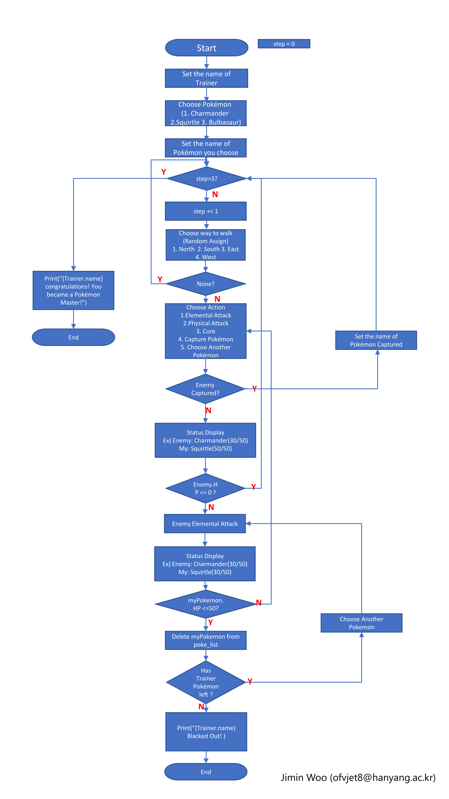

# Text-based Mini Pokemon Game

Hanyang University, Dept. of Data Science  
Creative Software Design by Hyunjoon Kim  
Assignment 1 - Text based Pokemon game  
Code by Dohoon Kim  
Link : https://github.com/tt-adisoh/csd_assignment_1

---
## Description

Your goal is to become Pokemon Master!  
You have 3 steps left, to become a Pokemon Master.  
Let's Choose Your Pokemon among 3 of Pokemons and take a walk!

---
## Pokemon Attributes
|||||
|---|---|---|---|
|Species|Charmander|Squirtle|Bulbasaur|
|Attribute|Fire|Water|Grass|
|Elemental Attack|Ember|Water Gun|Vine Whip|
|Physical Attack|Tackle|Tackle|Tackle|
|HP|50|50|50|
|Strong Against|Grass|Fire|Water|
|Weak Against|Water|Grass|Fire|
|Encounter<br>in Wild|30%|30%|30%

<br>
[ Elemental Attack Damage Table ]

|Elemental Attack|Ember|Water Gun|Vine Whip|
|-|-|-|-|
|Damage|10|10|10|

<br>
[ Physical Attack Damage Table ]

|Physical Attack|Tackle|
|-|-|
|Damage|9|

<br>
[ Pokemon Weakness Chart ]

|Type|Fire|Water|Grass|
|-|-|-|-|
|Fire|x1|x0.5|x2|
|Water|x2|x1|x0.5|
|Grass|x0.5|x2|x1|


---
## Flowchart  


Flowchart by TA Jimin Woo

---
## File Directory

```bash
CSD_ASSIGNMENT_1
├─ __pycache__
├─ readme.md
├─ main.py
├─ resources
│      └─ assignment1_flowchart.png
└─ modules
        ├─ battle_action.py
        ├─ battle.py
        ├─ Class.py
        ├─ initial_setting.py
        └─ ui.py
``` 